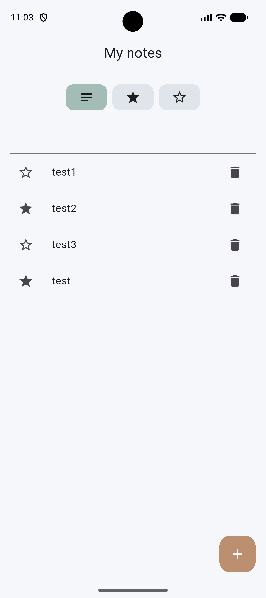
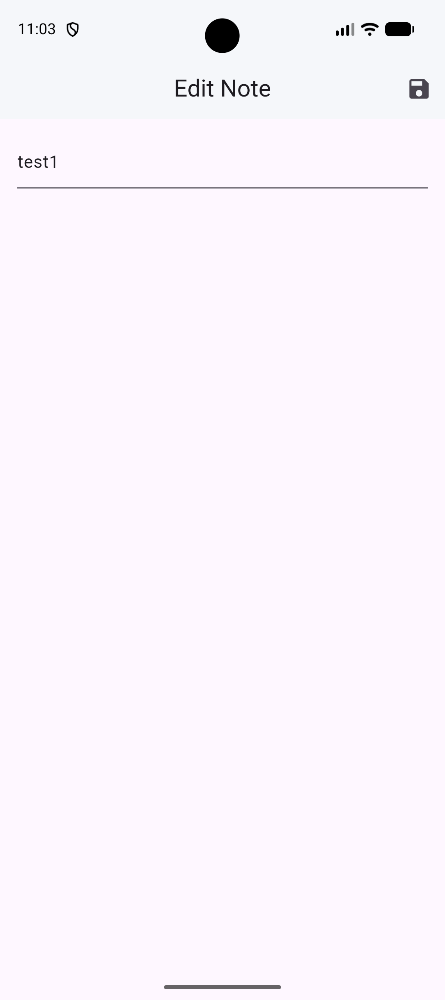

# Notes App 📝

A simple notes app built with Flutter and Riverpod, 
featuring favorites filtering and local persistence with Hive.

## Features
- Create, view, and delete notes
- Mark notes as favorite
- Filter notes: All / Favorites / Not Favorites
- Local data persistence (Hive)

## Tech Stack
- Flutter & Dart
- Riverpod 2.x (Notifier/NotifierProvider)
- Hive (local storage)
- GoRouter (navigation)
- Clean architecture (models/providers/screens/data)

## Screenshots

  
  

## About
This was one of my first Flutter projects, built 2 months ago.
I recently refactored it to follow clean architecture and 
migrated to the latest Riverpod syntax.